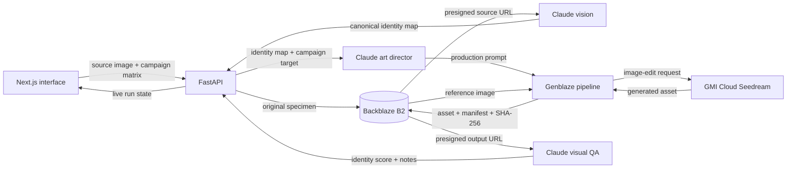

# BrandBlaze

**One product photograph in. An identity-consistent campaign library out.**

BrandBlaze is visual CI/CD for product campaigns. It transforms a single reference photograph into market-, channel-, and environment-specific imagery, tests every output against a machine-readable identity contract, repairs failed constraints, and preserves the complete decision record. Claude provides visual analysis and direction, Genblaze orchestrates GMI Cloud image editing, and Backblaze B2 stores the source, generated assets, manifests, hashes, approvals, and run index.

The project was built for the **Backblaze Generative Media Hackathon: Build with Genblaze on B2**.

> **Project status:** pre-1.0 and under active development. Start with a
> one-variant run because Claude and GMI requests consume provider credits.

## The problem

Brands need large quantities of campaign imagery for different markets and channels. Traditional production is slow and expensive, while ordinary image generation often changes the product itself: geometry drifts, components disappear, colors shift, patterns mutate, and logos become unreliable.

BrandBlaze treats the product as an invariant and the campaign world as a variable:

- **Locked:** geometry, component count, materials, colors, patterns, markings, and recognizable construction.
- **Variable:** market context, channel composition, environment, lighting, camera language, props, atmosphere, and aesthetic.

## What the app does

1. Accepts a PNG, JPG, or WEBP reference image.
2. Uploads the original source specimen to Backblaze B2.
3. Gives Claude vision the source image and the user's identity notes.
4. Produces a versioned identity contract with stable constraint IDs, confidence, evidence, and hard/soft requirements.
5. Creates a specific commercial-art-direction prompt for every requested combination.
6. Sends the reference image and prompt to GMI Cloud through a Genblaze pipeline.
7. Stores each generated image and its provenance manifest in B2.
8. Verifies the Genblaze manifest before accepting the output.
9. Uses Claude vision again to compare the generated product with the source.
10. Scores geometry, component count, color, material, markings, text, prominence, and channel fitness independently.
11. Automatically retries a failed result with a targeted repair contract that preserves successful creative elements.
11. Flags a second low-scoring attempt instead of presenting it as verified.
12. Preserves every attempt, prompt, hash, manifest, score, constraint failure, repair, and approval in B2 lineage.
13. Lets an operator approve, reject, or regenerate one asset without rerunning the campaign.

The UI currently supports preset and custom:

- markets;
- campaign channels;
- environments;
- art directions.

Each run is capped at 12 variants to control cost and execution time. When more combinations are requested, a deterministic coverage planner balances markets, channels, environments, and pair coverage instead of taking the first 12 Cartesian combinations.

## Why Backblaze B2 matters

Backblaze is not an afterthought or a generic upload destination in this project. B2 is the durable source of truth for the media pipeline.

- The source specimen is uploaded before generation begins.
- Genblaze writes outputs to B2 using `ObjectStorageSink`.
- Content-addressed keys reduce accidental duplication.
- SHA-256 hashes tie assets to their provenance.
- Genblaze manifests record pipeline lineage and verification data.
- Private objects are displayed through temporary presigned URLs.
- The backend writes an application-level run index beside Genblaze manifests.
- Durable B2 URLs remain separate from temporary browser-facing URLs.

This creates a verifiable asset tree rather than a folder of disconnected AI images.

## Architecture



## Technology stack

| Layer | Technology | Responsibility |
|---|---|---|
| Frontend | React, Next.js, vinext, Vite | Product setup, campaign matrix, live polling, results |
| Backend | FastAPI, Python | Validation, run lifecycle, orchestration, persistence |
| Vision and language | Anthropic Claude Sonnet 4.6 | Identity analysis, prompt direction, visual QA |
| Image generation | GMI Cloud Seedream 5 Lite | Reference-guided image generation |
| Orchestration | Genblaze | Provider execution, polling, retries, assets, manifests |
| Object storage | Backblaze B2 via S3-compatible API | Originals, variants, manifests, run indexes |

## Pipeline details

### 1. B2 source ingest

The backend validates the uploaded file type and 20 MB size limit, computes its SHA-256 digest, and stores it under:

```text
brandblaze/sources/<run-id>/original.<extension>
```

For private buckets, the backend creates a short-lived presigned URL so Claude and GMI can read the source without making the bucket public.

### 2. Claude identity contract

Claude inspects the image and separates immutable product identity from mutable campaign direction. The structured contract assigns stable IDs and confidence to observable constraints covering:

- immutable geometry;
- material and surface properties;
- logos, typography, motifs, and markings;
- visible camera evidence;
- explicit negative constraints.

### 3. Campaign prompt generation

Claude combines the identity map with one market, channel, environment, and aesthetic. Prompts specify composition, lens behavior, camera height, lighting, palette, surface, atmosphere, product placement, and negative constraints.

Market adaptation is expressed through art direction rather than flags, tourist symbols, stereotypes, or automatically generated written copy.

### 4. Genblaze and GMI fan-out

Each variant is executed as a real Genblaze image pipeline using `GMICloudImageProvider`. The original B2 image is attached as an external input with its media type and SHA-256 digest.

The backend runs a configurable number of variants concurrently. Remaining variants stay queued until a worker is available.

### 5. Storage and provenance

Genblaze stores generated assets through its B2-compatible S3 sink. A variant is not marked ready unless:

- GMI returned an asset;
- the asset has a durable B2 URL;
- the asset has a SHA-256 digest;
- `manifest.verify()` succeeds.

### 6. Claude visual QA

Claude receives the original and generated images and evaluates eight explicit axes: geometry, component count, color, material, logo/markings, text integrity, product prominence, and channel fit. Named hard-constraint failures override the aggregate score.

The score is an enforcement gate, not decoration. By default, results below
`IDENTITY_QA_THRESHOLD=85` are rejected and regenerated once with a structured
repair contract containing failed constraint IDs, protected constraints, and creative elements to preserve. If the final attempt is
still below threshold—or QA cannot produce a readable score—the variant is
preserved but marked `flagged`, never `ready`.

## Campaign operations

- The campaign board groups generated assets by market.
- The identity inspector shows source and output side by side.
- Attempt history exposes accepted and rejected generations.
- The B2 archive reloads completed run indexes after local state is gone.
- JSON and CSV exports provide durable asset URLs, hashes, scores, and metadata.
- Presigned browser URLs are refreshed when archived runs are opened.
- The pre-run budget shows baseline and worst-case Claude/GMI call counts.

## Run lifecycle

```text
queued -> running -> complete
                  \-> failed

variant:
queued -> generating -> ready
                    \-> reviewing -> retry -> ready
                                           \-> flagged
                    \-> failed
```

Run state is also persisted locally under `.runtime/runs`. If the backend restarts during a run, unfinished work is marked as interrupted instead of remaining permanently stuck in a fake running state.

## Prerequisites

- Node.js 22.13 or later
- Python 3.11 or later
- A Backblaze B2 bucket and application key
- An Anthropic API key with access to the configured Claude model
- A GMI Cloud API key with image-generation credits

## Configuration

Copy the example file:

```powershell
Copy-Item .env.example .env
```

Then configure:

| Variable | Required | Purpose |
|---|---:|---|
| `B2_KEY_ID` | Yes | Backblaze application key ID |
| `B2_APP_KEY` | Yes | Backblaze application key secret |
| `B2_BUCKET` | Yes | Target B2 bucket |
| `B2_REGION` | Yes | B2 S3 region, such as `us-west-004` |
| `B2_PUBLIC_BASE_URL` | No | Custom public asset base; leave empty for private buckets |
| `B2_SOURCE_URL_TTL` | No | Source presigned URL lifetime in seconds |
| `B2_OUTPUT_URL_TTL` | No | Output presigned URL lifetime in seconds |
| `ANTHROPIC_API_KEY` | Yes | Claude API key |
| `CLAUDE_MODEL` | Yes | Claude model used for vision, prompting, and QA |
| `GMI_API_KEY` | Yes | GMI Cloud API key |
| `GMI_IMAGE_MODEL` | Yes | GMI image model; default is `seedream-5.0-lite` |
| `GMI_IMAGE_SIZE` | No | Requested output size |
| `GMI_OUTPUT_FORMAT` | No | Generated file format |
| `GENBLAZE_CONCURRENCY` | No | Simultaneous image jobs |
| `GENBLAZE_TIMEOUT` | No | Per-pipeline timeout in seconds |
| `MAX_VARIANTS_PER_RUN` | No | Server-side cost guardrail |
| `IDENTITY_QA_THRESHOLD` | No | Minimum score required for verified status |
| `IDENTITY_MAX_ATTEMPTS` | No | Maximum generation attempts per variant |
| `ALLOWED_ORIGINS` | Yes | Frontend origins allowed by CORS |
| `NEXT_PUBLIC_API_URL` | Yes | Browser-visible FastAPI URL |

Never commit `.env`. The repository ignores secret-bearing environment files while keeping `.env.example`.

## Installation

### Backend

```powershell
python -m venv .venv
& .\.venv\Scripts\python.exe -m pip install -r api\requirements.txt
```

### Frontend

```powershell
npm.cmd install
```

## Running locally on Windows

Start the API:

```powershell
& .\.venv\Scripts\python.exe -m uvicorn api.main:app --reload --host 127.0.0.1 --port 8000
```

Start the frontend in another PowerShell window:

```powershell
npm.cmd run dev
```

Open:

```text
http://localhost:3000
```

If Windows refuses port 8000 with `WinError 10013`, use port 8010:

```powershell
& .\.venv\Scripts\python.exe -m uvicorn api.main:app --reload --host 127.0.0.1 --port 8010
```

Then set:

```dotenv
NEXT_PUBLIC_API_URL=http://127.0.0.1:8010
```

PowerShell requires the leading `&` when the executable path is quoted.

## Using the application

Open `http://localhost:3000` for the public product story, then select **Open studio** to enter the campaign workspace at `http://localhost:3000/studio`.

The studio uses three editable steps:

1. **Product:** upload a clear photograph, enter the product name, and describe the immutable identity lock.
2. **Campaign:** select or add markets, channels, environments, and an art direction.
3. **Review:** confirm the campaign matrix and maximum provider-call budget, then select **Generate campaign**.

Keep the backend running until all variants complete. The live asset matrix shows pipeline progress without mixing the product setup into the public landing page.

For the first paid test, use one market, one channel, and one environment. Expand the matrix only after validating the result.

## Docker deployment

BrandBlaze ships as one portable container. It runs the vinext frontend, FastAPI/Genblaze backend, and an Nginx reverse proxy in a single web service:

- `/` and `/studio` route to the frontend;
- `/health` and `/api/*` route to FastAPI;
- the public port comes from the host's `PORT` environment variable;
- the browser uses same-origin API requests, so `NEXT_PUBLIC_API_URL` and production CORS configuration are unnecessary.

Build and run locally:

```powershell
docker build -t brandblaze .
docker run --rm -p 10000:10000 --env-file .env -e PORT=10000 brandblaze
```

Open `http://localhost:10000` and confirm `http://localhost:10000/health` returns JSON.

### Deploy the complete application on Render

1. In Render, choose **New → Blueprint**.
2. Connect the BrandBlaze GitHub repository.
3. Render detects `render.yaml` and creates one Docker web service.
4. Enter each secret marked `sync: false`.
5. Deploy, then open the generated `onrender.com` URL.

The free Render service is suitable for a hackathon demo but sleeps after inactivity and has an ephemeral filesystem. Generated media and manifests remain durable in Backblaze B2; local run-index files can disappear when the container restarts. Use a paid persistent service for production.

## API

### Health

```http
GET /health
```

Reports whether B2, Claude, and GMI configuration values are present. It does not spend provider credits.

### Create run

```http
POST /api/runs
Content-Type: multipart/form-data
```

Fields:

- `file`
- `product_name`
- `brief`
- `markets` as a JSON array
- `channels` as a JSON array
- `environments` as a JSON array
- `aesthetic`

### Read run

```http
GET /api/runs/{run_id}
```

The frontend polls this endpoint while generation is active.

### List local and B2-backed runs

```http
GET /api/runs?include_b2=true&limit=40
```

### Export campaign metadata

```http
GET /api/runs/{run_id}/export?format=json
GET /api/runs/{run_id}/export?format=csv
```

## Verification and tests

Offline backend tests do not call Claude, GMI, or B2:

```powershell
& .\.venv\Scripts\python.exe -m unittest discover -s api/tests -v
```

Frontend lint:

```powershell
npm.cmd run lint
```

Production build and UI integrity tests:

```powershell
npm.cmd test
```

To perform byte-level verification of a remote Genblaze output:

```powershell
genblaze verify --fetch <manifest-url>
```

## Troubleshooting

### `model ... not found` from Anthropic

The configured model is unavailable to the API key. Query the account's available models or set `CLAUDE_MODEL` to an accessible vision-capable model. The current project default is:

```dotenv
CLAUDE_MODEL=claude-sonnet-4-6
```

### GMI remains `submitted`

This is normally Genblaze polling an accepted GMI job. Generation can take more than a minute. With concurrency set to three, three variants generate while the rest remain queued.

### Browser reports `Backend offline`

Confirm the API is running and that `NEXT_PUBLIC_API_URL` matches its host and port. Restart the frontend after changing `.env`.

### Browser blocks `file:///...woff2`

The project uses system fonts and does not require `next/font`. Stop stale frontend processes, restart `npm.cmd run dev`, and hard-refresh the browser.

### Images expire in the browser

Browser URLs are intentionally temporary for private B2 buckets. The durable asset remains in B2. Increase `B2_OUTPUT_URL_TTL` or request a new presigned URL in a future archive workflow.

### A run is interrupted

Stopping or reloading the backend terminates in-process worker threads. Persisted unfinished runs are marked failed on restart. Start a new run.

## Cost and operational notes

- Claude is called once for identity analysis, once per variant for prompt creation, and once per completed variant for visual QA.
- GMI is called once per generated variant.
- Selecting two markets, two channels, and two environments creates eight variants.
- The backend truncates larger matrices to `MAX_VARIANTS_PER_RUN`.
- A failed Claude identity analysis occurs before GMI fan-out and therefore does not create image-generation jobs.
- Do not stop the backend while Genblaze jobs are running.

## Current limitations

- Workers run inside the FastAPI process rather than a durable external queue.
- Run history has no dedicated archive browser yet.
- Presigned browser URLs expire.
- Identity QA is model-based evaluation, not a deterministic computer-vision metric.
- Text and logo fidelity still depend on the image model.
- A single source photo cannot reveal hidden product geometry.
- Variants are generated independently; cross-variant consistency is guided by the shared reference and identity map rather than a trained product model.

## Project structure

```text
brandblaze/
|-- app/
|   |-- page.tsx         # Public landing page
|   `-- studio/page.tsx  # Three-step campaign workspace
|-- api/
|   |-- main.py           # FastAPI and generation pipeline
|   |-- requirements.txt
|   `-- tests/            # Offline API lifecycle tests
|-- tests/                # Frontend integrity tests
|-- .runtime/runs/        # Ignored local run persistence
|-- .env.example
|-- package.json
`-- README.md
```

## Hackathon positioning

BrandBlaze demonstrates that generative media infrastructure is not only about producing an image. A useful production system must preserve the source, manage provider execution, record lineage, verify outputs, and keep durable assets available after a model request ends.

The central hackathon story is:

> **Genblaze creates the verifiable media pipeline; Backblaze B2 makes every branch durable, addressable, deduplicated, and auditable.**

That combination turns one product photo into a governed campaign asset tree rather than a collection of disposable generations.

## Contributing

Contributions are welcome. Read [CONTRIBUTING.md](CONTRIBUTING.md) before
opening a pull request. By participating, you agree to follow the
[Code of Conduct](CODE_OF_CONDUCT.md).

## Security

Do not report vulnerabilities or leaked credentials in public issues. Follow
the private reporting process in [SECURITY.md](SECURITY.md).

## License

BrandBlaze is available under the [MIT License](LICENSE).
