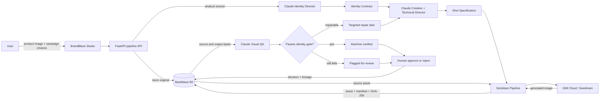
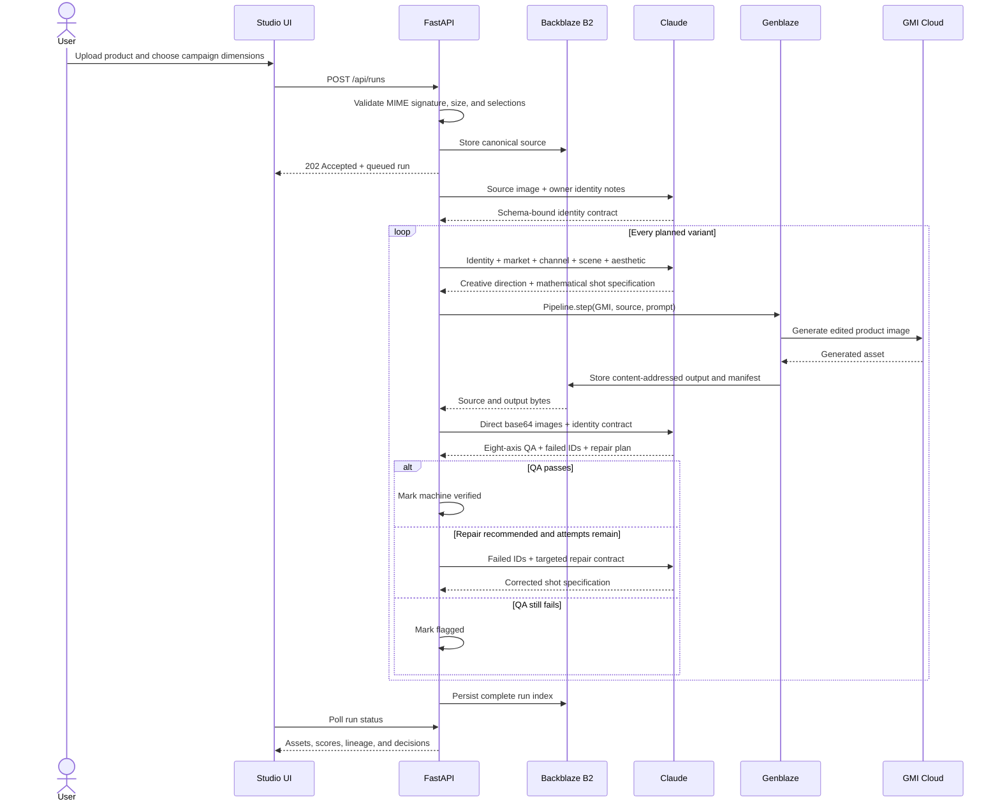
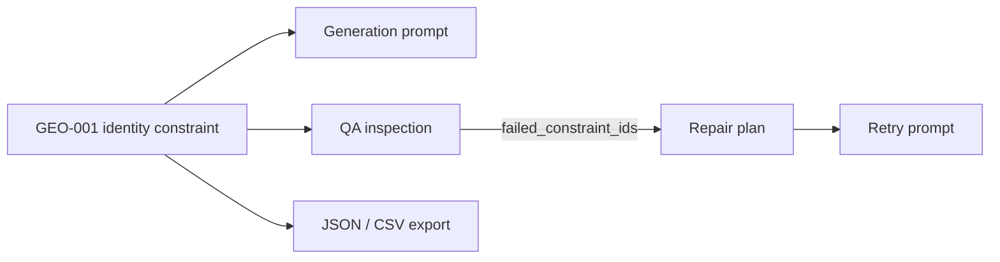
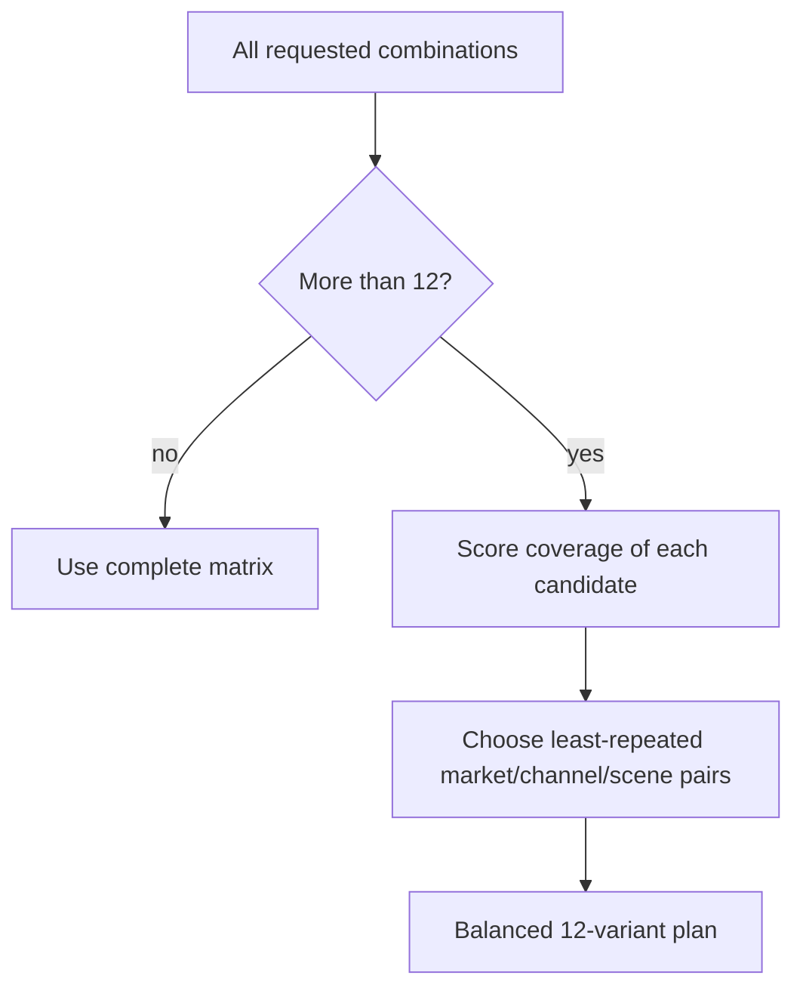
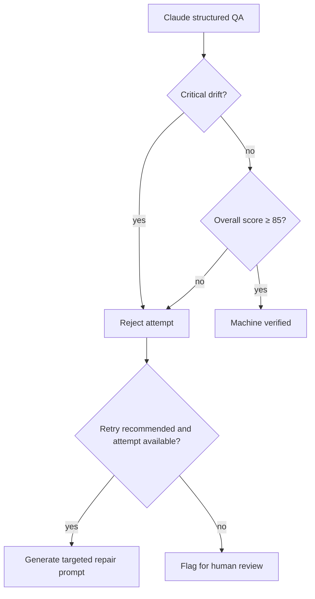
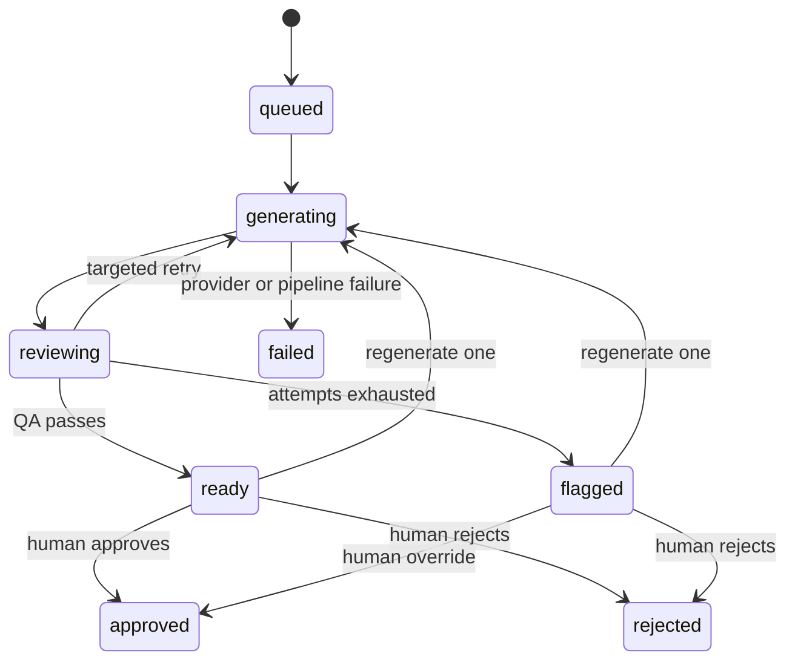
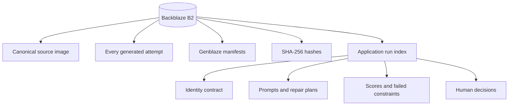
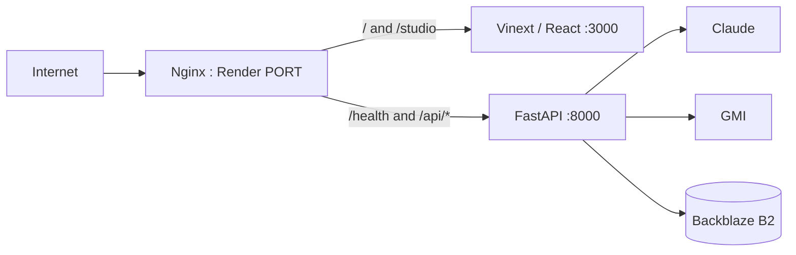

# How BrandBlaze Works

BrandBlaze is a **visual campaign production and verification pipeline**. It takes one real product photograph, produces campaign variations for different markets and channels, rejects product-identity drift, and stores the complete history in Backblaze B2.

The simplest mental model is:

> **Source product → identity contract → creative/technical shot plan → generated image → visual QA → repair or approval → permanent B2 record**

## 1. System overview



## 2. What each service does

| Component | Responsibility | Why it matters |
|---|---|---|
| BrandBlaze Studio | Upload, campaign setup, progress, comparison, approvals, exports | Gives the operator one production workspace |
| FastAPI backend | Validates inputs and controls the workflow | Keeps secrets and paid provider calls off the browser |
| Claude | Identity analysis, shot planning, visual QA, repair planning | Provides visual reasoning at three distinct stages |
| Genblaze | Runs GMI, handles assets, manifests, fallbacks, and storage | Makes generation reproducible and auditable |
| GMI Cloud / Seedream | Creates the campaign image from the source and prompt | Performs the image-editing/generation step |
| Backblaze B2 | Stores sources, attempts, accepted outputs, hashes, manifests, and run indexes | Provides durable campaign memory and lineage |

Genblaze is the **orchestration layer**. Backblaze B2 is the **system of record**.

## 3. Complete run sequence



## 4. The identity contract

Claude does not return a loose description. It calls a schema-bound tool that produces at most 16 concise constraints.

Each constraint contains:

```json
{
  "id": "GEO-001",
  "dimension": "geometry",
  "description": "Preserve the tall clear-glass bottle silhouette",
  "confidence": 0.98,
  "evidence": "observed",
  "hard": true
}
```

The stable ID connects the full lineage:



- **Hard constraint:** failure can create critical drift regardless of the average score.
- **Soft constraint:** important, but uncertainty or occlusion prevents treating it as absolute.
- **Confidence:** how certain Claude is that the feature is visible or owner-confirmed.
- **Evidence:** observed in the photograph, supplied by the owner, or inferred.

## 5. Campaign planning

The campaign matrix is built from:

```text
Markets × Channels × Environments
```

If the full matrix exceeds `MAX_VARIANTS_PER_RUN` (12 by default), BrandBlaze does not simply take the first 12. Its planner chooses combinations that maximize unused markets, channels, environments, and dimension pairs.



## 6. Hybrid prompt design

The generation prompt has three layers, in strict priority order:

1. **Identity constraints** — what cannot change.
2. **Creative direction** — the visual idea, emotion, atmosphere, palette, material contrast, and subtle market relevance.
3. **Technical execution** — the measurable instructions required to reproduce that idea.

The technical layer includes:

- aspect ratio and pixel target;
- product bounding box as `x/y/width/height` percentages;
- frame occupancy, safe margins, and horizon position;
- camera distance and height;
- yaw, pitch, and roll;
- full-frame-equivalent focal length;
- aperture, shutter speed, ISO, focus distance, and depth of field;
- white balance in Kelvin;
- light angle, elevation, distance, CCT, and relative output;
- key-to-fill ratio, surface reflectance, and shadow direction;
- channel crop requirements.

Prompts are plain text. Markdown tables, document titles, formatting markers, and report syntax are removed before GMI receives them.

```text
CREATIVE DIRECTION: Mediterranean clarity expressed through warm limestone...

CAMERA: distance 1.8 m; height 0.72 m; yaw 0°; pitch -2°; roll 0°; 85 mm FF equivalent.

KEY LIGHT: large soft source; azimuth 35° left; elevation 45°; distance 2.2 m; 4800 K; output 1.0.
```

## 7. Genblaze generation and B2 storage

For each attempt, BrandBlaze constructs a Genblaze pipeline:

```python
Pipeline(attempt_name, tenant_id=run_id) \
    .step(gmi_provider, prompt=prompt, external_inputs=[source_asset], ...) \
    .run(sink=backblaze_storage_sink)
```

The sink uses content-addressable keys. Identical bytes resolve to the same content identity instead of being treated as unrelated files.

An attempt is not accepted unless:

1. GMI returns an asset;
2. the asset has a durable B2 URL;
3. the asset has a SHA-256 digest; and
4. the Genblaze manifest verifies.

## 8. Visual QA

BrandBlaze reads the canonical source and generated output through authenticated B2 access and sends their bytes directly to Claude. It does not depend on Claude downloading temporary signed URLs.

Claude scores eight axes:

| QA axis | What is inspected |
|---|---|
| Geometry | Silhouette, proportions, construction, placement of major shapes |
| Component count | Missing or added pockets, caps, handles, pieces, hardware |
| Color | Product and packaging color fidelity |
| Material | Leather, glass, ceramic, metal, fabric, finish |
| Logo and markings | Logo shape, placement, seals, badges, embossing |
| Text integrity | Correct visible wording and typography |
| Product prominence | Visibility, sharpness, obstruction, crop |
| Channel fit | Whether the composition works for the selected channel |

The default identity threshold is `85`.



Critical drift includes missing or altered logos, primary material/color changes, missing distinctive components, or changed core geometry.

## 9. Targeted repair

A rejected attempt produces a structured repair plan:

```json
{
  "severity": "critical",
  "protected_constraints": ["COL-001", "MAT-001"],
  "preserved_creative_elements": ["warm coastal backlight"],
  "repair_instruction": "Restore LOGO-001 without changing the accepted lighting setup",
  "retry_recommended": true
}
```

This is intentionally narrow. The retry should repair the failed identity constraints without redesigning everything that already worked.

## 10. Variant states



“Machine verified” and “human approved” are deliberately separate decisions.

## 11. What is stored in B2



The application-level index is stored at:

```text
brandblaze/indexes/{run_id}.json
```

This makes the campaign recoverable from B2 even after the Render container restarts.

## 12. Deployment architecture

BrandBlaze is deployed as one Docker service on Render.



Supervisor runs three processes inside the container:

- the Vinext frontend;
- the FastAPI backend;
- Nginx as the public reverse proxy.

This is why the correct production application is the Render deployment, not the old frontend-only Vercel deployment.

## 13. Main API routes

| Route | Purpose |
|---|---|
| `GET /health` | Confirms provider and storage configuration |
| `POST /api/runs` | Uploads the source and starts a campaign |
| `GET /api/runs` | Lists local and optional B2 campaign indexes |
| `GET /api/runs/{run_id}` | Returns live or archived run state |
| `POST /api/runs/{run_id}/variants/{variant_id}/decision` | Approves or rejects a completed asset |
| `POST /api/runs/{run_id}/variants/{variant_id}/regenerate` | Regenerates only one asset |
| `GET /api/runs/{run_id}/export?format=json` | Downloads complete machine-readable lineage |
| `GET /api/runs/{run_id}/export?format=csv` | Downloads campaign handoff data |

## 14. Cost model

For `N` planned variants and a maximum of two attempts:

```text
Minimum Claude calls ≈ 1 identity call + N prompt calls + N QA calls
Maximum Claude calls ≈ 1 + (2 × N prompt calls) + (2 × N QA calls)
Minimum GMI images = N
Maximum GMI images = 2N
```

A formatting or QA transport failure is configured not to recommend a paid GMI retry. Only a repairable visual defect should spend the second image attempt.

## 15. One-sentence hackathon explanation

> BrandBlaze uses Claude to convert a product photograph into traceable identity constraints and technical campaign directions, Genblaze to orchestrate GMI image generation, and Backblaze B2 to preserve every source, attempt, manifest, hash, QA result, repair, and human decision as an auditable visual production pipeline.

